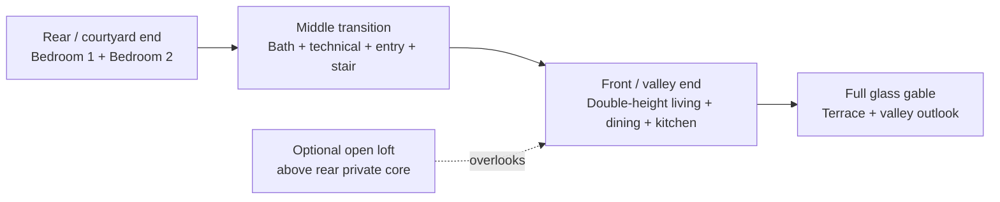

# Architectural Concept

- Status: **pre-design concept**
- Location: Schorisse, rural Flanders, Belgium
- Envelope: **17.0 × 7.5 m (127.5 m² footprint)**

This document preserves the architectural thinking that previously lived in the
visual website. It is not a measured survey, planning submission, construction
drawing or specification.

## Project brief

Demolish and rebuild the main barn within its existing footprint and pitched
silhouette. The proposal combines a two-bedroom ground floor with a large
valley-facing living hall and an optional partial open loft.

The design intent is deliberately simple:

- keep the familiar rural barn volume;
- make the valley-facing gable the principal source of light and view;
- place bedrooms and services in the private rear portion;
- retain the working access, neighbouring buildings and established landscape;
- use a thick insulated-concrete-form wall shell with one continuous Belgian
  brick exterior, black-framed openings and a black ceramic-tile roof.

## Fixed envelope

| Element | Concept dimension |
|---|---:|
| Length | 17.0 m |
| Width | 7.5 m |
| Footprint | 127.5 m² |
| Eaves | 3.2 m |
| Ridge | 5.2 m |
| Symmetric roof rise | 2.0 m over a 3.75 m half-span |
| Implied roof pitch | approximately 28.1° |

The 28.1° pitch is derived from the fixed eaves, ridge and width. It supersedes
the approximate 45° note in the early handoff material.

The original length estimate used a paced site check: approximately 25 natural
paces at 0.67–0.70 m suggested 16.8–17.5 m. A measured survey must replace that
estimate before design development.

## Existing site and retained context

Only the main barn is the concept rebuild target.

- **Shared tractor lane:** retain the full hedge-to-building working width,
  pasture gate and access route. No doors, canopies or other projections may
  obstruct it.
- **Glass-gable end:** retain the neighbouring brick building, narrow paved
  passage, left hedge, ground levels and drainage context.
- **Valley outlook:** use the actual Schorisse fields, tree clusters and boundary
  hedge as the living-room view.
- **Cobbled courtyard:** retain the cobbles, curbs, clipped hedges, hydrangeas,
  mature canopy and non-target structures.
- **Side wing:** retain the existing wing; resolve the new junction with an
  architecturally and structurally appropriate separation detail.

Dry grass may be restored to healthy green in visualizations. Temporary debris,
people, portable facilities and transient shadows are not design constraints.

## Adopted spatial program

The building is organized along its 17 m length rather than by evenly spacing
windows on the exterior.

### Ground floor

| Zone | Concept use |
|---|---|
| Rear private zone | Two bedrooms, approximately 16 m² each in the early plan |
| Middle service zone | Bathroom, technical space, storage, courtyard entrance and stair |
| Front living zone | Approximately 60 m² open living, dining and kitchen space |
| Valley end | Full-height glazed gable with one or two lift-slide door leaves |

Core daily living remains on the ground floor. The optional loft is extra living
space rather than a requirement for bedrooms, bathroom or normal access.

## Exterior expression

### Valley gable

- approximately 7.0 m glazed field within the 7.5 m gable;
- concept height approximately 4.9 m;
- horizontal transom at approximately 3.0 m;
- triangular clerestory following the pitched roof;
- slim dark-bronze or dark-anodised frames;
- deep ICF perimeter reveal without screens, fins or columns across the glass;
- one or two central lift-slide door leaves with a flush threshold.

### Shared-lane elevation

The openings communicate the interior sequence:

1. modest bedroom windows at the rear;
2. a tall narrow stair marker at the transition;
3. a larger living-room opening toward the valley end.

There is no entrance on the tractor-lane facade. All windows remain clear and
unobstructed; the thick wall build-up is expressed through deep reveals.
Three low-profile shielded downlights sit beneath the eaves to identify the room
sequence after dark without introducing posts, bollards or projections into the
working lane.

### Courtyard elevation

- one clearly identifiable entrance in the rear/service zone: a full-height
  smoked-oak door and vertical timber-lined recess inside a deep matte-black
  portal, with a concealed warm soffit light;
- clear residential windows aligned with the rooms rather than formal symmetry;
- one broad triangular black-framed window in the upper rear gable, lighting the
  open loft while remaining smaller and quieter than the front glass wall;
- optional small flush rooflights above the rear loft;
- retained cobbles and planted foreground.

### Selected material direction

**Belgian Brick Lantern** uses the complete ICF external wall shell with one
continuous contemporary warm Belgian/Flemish brick veneer on every exterior
wall. There is no fibre-cement or timber wall cladding and no material break
between the living and private zones.

Prominent matte-black aluminium or pressed-metal liners wrap the deep window and
door reveals. The full glass gable uses the same black perimeter and slim black
mullions. A black roof of small gently curved hollow ceramic Flemish tiles,
black rainwater details and a smoked-oak courtyard entrance complete the exterior.
The masonry is a non-load-bearing exterior finish over the ICF shell, not a
reconstruction of the existing brickwork.

Timber remains limited to the joinery and inner lining of the recessed entrance;
it does not become a second exterior wall finish. The front gable piers receive
restrained shielded warm downlights, while the lane uses shallow eaves-mounted
fixtures that preserve tractor clearance and limit spill toward the neighbour.

### Interior and exterior opening alignment

The interior concept follows the same opening order as the exterior elevations.
Looking from the front glass gable toward the rear loft, the larger lane-facing
living window sits above the kitchen worktop, the tall stair window lights the
stair, and the broad triangular rear gable window forms the outlook behind the
loft lounge. The two rear bedroom windows remain inside the enclosed bedroom
zone beneath the loft and therefore do not open into the living hall.

## Optional partial open loft

The loft is a compact rear mezzanine, not a full second storey.

- concept length: approximately 7–8.5 m over the bedrooms/service zone;
- front 8.5–10 m remains double-height;
- concept loft floor: approximately +2.40–2.45 m;
- stair rises near the ridge at the transition;
- low-eaves edges become storage, shelving and seating;
- the rear triangular gable window brings daylight and an outlook directly into
  the loft without extending glazing down into the bedrooms;
- preliminary comfortable standing area: approximately 10–18 m² after allowing
  for structure and insulation.

Inner roof geometry, clear heights, stair headroom, structure, guarding, fire
strategy and permitting require measured design by the architect and engineer.

## 3D massing resources

- [`../models/barn.glb`](../models/barn.glb) — coloured glTF massing model.
- [`../models/barn.stl`](../models/barn.stl) — shell for SketchUp or another 3D tool; import in metres.
- [`../models/gen_model.py`](../models/gen_model.py) — source generator based on the concept dimensions.

The current model is an exterior reference shell. It does not resolve the loft,
wall build-ups, structure, services or construction details.

## Required design-development checks

1. Commission a measured survey and confirm orientation, levels and boundaries.
2. Confirm planning status and allowable rebuild volume with the municipality.
3. Obtain a structural assessment of the existing barn and retained junctions.
4. Verify internal room heights after the floor, roof and insulation build-ups.
5. Coordinate the ICF wall core, roof support, glazing perimeter, loft and stair.
6. Develop accessibility, fire safety, drainage, ventilation and energy strategy.
7. Replace all concept dimensions with coordinated architect/engineer drawings.

The selected material-direction prompts are recorded in
[`../renders/belgian-brick-lantern/README.md`](../renders/belgian-brick-lantern/README.md).
The previous full-black and mixed-material sets remain in the repository as
superseded studies.
Earlier site-reference notes remain in
[`../renders/site-concepts/README.md`](../renders/site-concepts/README.md).
